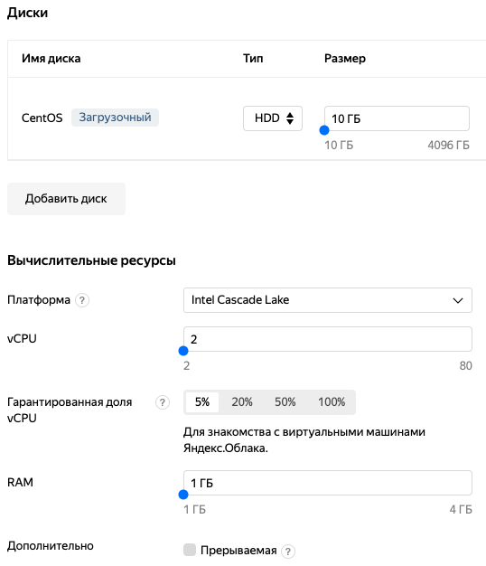
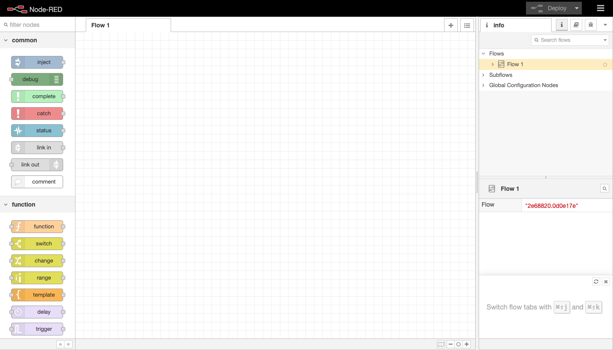
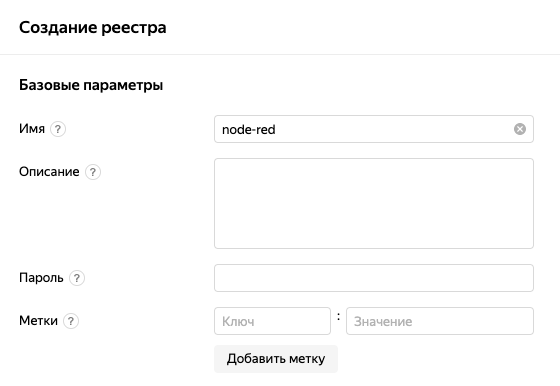

# node-red-iot-core

## Node-RED для Yandex IoT Core (рабочее название)


План статьи на базе так называемой техники STAR - начиная с описания ситуации и задачи (ST = Situation/Task), потом с действий, которые вы сделали (A = Actions) и заканчивая результатами (R = Results):

### <Вит> 1) Краткое описание про что такое Node-RED - изумительный инструмент для быстрого прототипирования на Node.JS

Как было отмечено ранее, одним из наиболее важных факторов ограничивающих развитие интернета вещей является отсутствие удобных средств разработки правил взаимодействия устройств IoT между собой. Для решения этой задачи был разработан Node-RED, позволяющий через браузер построить схему взаимодействия устройств между собой и внешними системами.

### <Вит> 2) Можно кратко написать про ключевого разработчика (Nicholas O'Leary/UK/IBM) и сообщество Node-RED

Node-RED is made available under the terms of the Apache 2 license. It's important to understand the terms of that license, but this provides a good summary - https://tldrlegal.com/license/apache-license-2.0-(apache-2.0) The license allows for commercial usage. The main restrictions are: they cannot misrepresent the Node-RED trademark (which belongs to the OpenJS Foundation) and they cannot hold the project liable for anything they chose to do with it.

### <Вит> 3) Постановка задачи - интеграция Node-RED c Yandex IoT Core для создания прототипа приложения "Умное ЖКХ" или "Самоуправляемые Автомобили" лизнуть Яндексу (вставить любое)

### <Макс> 4) Создание ВМ на CentOS и установка Node-RED и автоматический запуск сервиса (автозагрузка) через systemctl

#### Создание ВМ
Для создания виртуальной машины, на которой далее запустим Node-RED, зайдем в [Яндекс Облако](https://cloud.yandex.ru/) и перейдем в [Консоль](https://console.cloud.yandex.ru/).
В сервисе *Compute Cloud* нажимаем **Создать ВМ**.

Задаем машине любое разрешенное имя и в качестве операционной системы выбираем CentOS. Для запуска Node-RED подходит любая из приведенных ОС, однако в данной статье рассмотрен порядок работы только с CentOS.


Выполнение тестового сценария не требует больших ресурсов, поэтому выставляем все на минимум. Данный ход также позволит сэкономить ресурсы пробного периода, если Вы решили развернуть Node-RED только для ознакомления.



Работа с ВМ будет осуществляться через SSH, поэтому выделим автоматически выделенный публичный адрес машине.
Для подключения к машине по SSH необходимо указать публичный ключ. Сгенерируем SSH-ключи командой `ssh-keygen -t rsa -b 2048` в терминале, потребуется придумать ключевую фразу.
Теперь требуемый ключ хранится в `~/.ssh/is_rsa.pub`, копируем его в поле *SSH-ключ* и жмем **Создать ВМ**.


    

#### Подключение к ВМ
После завершения процесса подготовки ВМ в сервисе *Compute Cloud* появится наша машина с заполненным полем *Публичный IPv4*.
Также нам необходим логин, который мы указывали на предыдущем шаге в разделе *Доступ*.
Выполним подключение к машине по SSH командой
`$ ssh <login>@<IPv4>`. При подключении потребуется ввести ключевую фразу, которую мы указали на этапе генерации ключей.


#### Установка Node-RED
Наконец, мы можем установить Node-RED. Самый удобный способ для новой, пустой системы - это [Linux installers for Node-RED](https://github.com/node-red/linux-installers)
из репозитория данного проекта. Так как мы используем *CentOS 8*, нам необходима вторая команда для ОС, основанных на RPM:
```
$ bash <(curl -sL https://raw.githubusercontent.com/node-red/linux-installers/master/rpm/update-nodejs-and-nodered)
```

Соглашаясь с предупреждениями о порте 1880 и установке node.js, наблюдаем за установкой. Убедимся, что установка выполнена успешно запуском Node-RED:
```
$ node-red-start
```
После этого по адресу `http://{ip вашей машины}:1880` в браузере будет доступен для работы Node-RED.


*... здесь будет про systemctl или другой способ (команда сверху не работает с sudo)*


### <Макс> 5) Детальная настройка Yandex IoT Core: создание реестра, устройста и id/логины/пароли
Возвращаемся в [Консоль](https://console.cloud.yandex.ru/), выбираем *IoT Core* и нажимаем **Создать реестр**. Указываем любое подходящее имя и далее определимся со способом авторизации.
IoT Core поддерживает два способа: с помощью сертификатов и по логину-паролю. Для нашего тестового сценария намного быстрее использовать последний, поэтому заполним поле *Пароль*, длина пароля минимум 14 символов.



После создания переходи в реестр во вкладку *Устройства* слева и нажимаем **Добавить устройство**.
Аналогично реестру задаем имя и пароль. 

Теперь в пункте *Обзор* реестра видим *ID* реестра и помним пароль, которые писали при создании реестра. Тоже самое с устройством: на странице устройства указан его *ID*.
### <Макс> 6) Создание приложения в Node-Red (MQTT-nodes-out-in, function, dashboard)
Перейдем в `http://{ip вашей машины}:1880`. Импортируем готовый пример, где нам потребуется лишь указать наши данные реестра и устройства.
В меню в правом верхнем углу Node-RED нажмем *Import*. Flow в формате *.json* берем [отсюда](https://github.ibm.com/vitaly-bondarenko/node-red-iot-core/blob/master/sample_device.json) и либо копируем содержимое в поле, либо скачиваем файл и жмем *select a file to import*.
В новой вкладке появляется flow *testing connection*, в нем два раза кликаем по ноду *device*. 
Нам необходимо заменить *<id_реестра>* на ID нашего реестра в IoT Core. Далее редактируем данные в *Server*. Во вкладке *Security* указываем username - это ID созданного нами устройства, а password - пароль, придуманный на этапе создания устройства. После чего сначала жмем *Update*, а далее *Done*.
Протестируем соединение: в правом верхнем углу нажмем *Deploy*. Под нодом *device* появится подпись *connected*.

Импортируем [flow с dashboard](https://github.ibm.com/vitaly-bondarenko/node-red-iot-core/blob/master/sample_dashboard.json)
таким же образом. После импорта будет показано сообщение о недостающих компонентах, загрузим их. В меню в правом верхнем углу перейдем в *Manage palette*. В появившемся окне во вкладке *Install* в поисковом поле пропишем `node-red-dashboard` и в найденных пакетах установим самый первый. Таким же образом установим `node-red-contrib-web-worldmap`.
Теперь необходимо настроить нод *registry*. Аналогично первому flow записываем наш ID реестра и переходим в настройки сервера *iot-core-subscription*. 
Во вкладке *Security* добавляем данные **реестра**, сохраняем изменения и жмем *Deploy*.

Если все поля заполнены верно, то после развертывания под нодом registry тоже появится подпись *connected*. 
В окне справа последння вкладка с иконкой столбчатой диаграммы отвечает за *Dashboard*. Перейти в Dashboard можно по кнопке, выделенной на скриншоте.


Каждые 3 секунды устройство из flow *testing connection* генерирует данные, отправялет их в топик нашего реестра, а flow *Smart Utilities* в свою очередь подписывается на этот топик и обновляет *Dashboard* в соответствии с приходящими с IoT Core данными.


### <Вит> 7) Краткое заключение / набор полезных материалов (ссылки)


На перспективу (Roadmap)
- Адаптировать коннектор NodeRED для Яндекс IoT Core (MQTT) чтобы было меньше полей
- Написать коннектор NodeRED для Яндекс ServerLess
