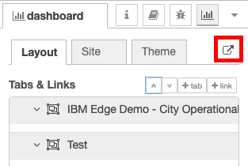
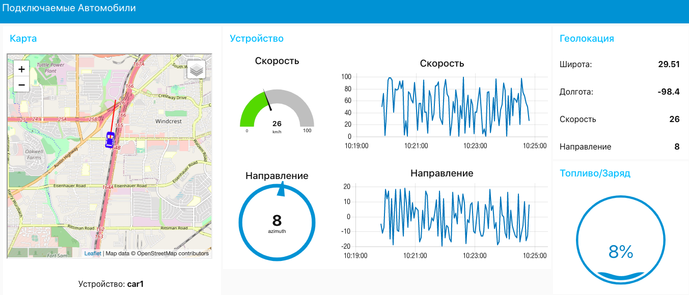

# Node-RED для Yandex IoT Core (рабочее название)


План статьи на базе так называемой техники STAR - начиная с описания ситуации и задачи (ST = Situation/Task), потом с действий, которые вы сделали (A = Actions) и заканчивая результатами (R = Results):


## Визуальное программирование для Интернета Вещей с минимум кода

Написано уже немало статей на тему использования средств визуального программирования при создании приложений для Интернета Вещей ([один](https://habr.com/ru/post/396985/), [два](https://habr.com/ru/company/tinkoff/blog/487984/), [три](https://habr.com/ru/company/tinkoff/blog/489774/)), управления разнообразными устройствами и домашней автоматизации. Однако мало кто упоминает о другом полезном свойстве подобных иструментов - это быстрое прототипирование, то есть эмуляция самих устройств и визуализация результатов их работы без грубоких познаний в программировании или веб-дизайне.

В этой статье хотелось бы разобрать один из наиболее популярных инструментов с открытым исходным кодом - [Node-RED](https://nodered.org/), с точки зрения создания простых прототипов приложений с минимум программирования, проверить гипотезу о простоте и удобстве таких средств, а также рассмотреть его взаимодействие с альтернативной облачной платформой в отрыве от его родной [IBM Cloud](https://cloud.ibm.com/).

**Кратко о Node-Red, его истории, создателях и сообществе**

Как гласит первоисточник, [Node-RED](https://nodered.org/about/) - это инструмент потокового программирования, первоначально разработанный командой [IBM Emerging Technology Services](https://emerging-technology.co.uk/) и в настоящее время являющийся частью [JS Foundation](https://openjsf.org/).

В качестве ключевой составляющей Node-RED выступает парадигма [потокового программирования](https://en.wikipedia.org/wiki/Flow-based_programming), которое было изобретено в 1970-х годах Дж. Полом Моррисоном (J. Paul Morrison). Потоковое программирование - это способ описания поведения приложения в виде сети чёрных ящиков или «узлов», как они называются в Node-RED. Каждый узел имеет четко определенную цель - к нему поступают некоторые данные, он что-то делает с этими данными, а затем передает эти данные на следующий узел. Сеть отвечает за поток данных между узлами.
Эта модель очень хорошо подходит для визуального представления и делает ее более доступной для широкого круга пользователей. Если кто-то пытается разобраться в проблеме, он может разбить задачу на отдельные шаги, взглянуть на поток и понять, что он делает без необходимости разбираться в отдельных строках кода на каждом узле.

Node-RED работает в среде исполнения Node.js, а для создания или редактирования потока ("Flow") используется веб-браузер. В браузере вы можете создавать свое приложение путем перетаскивания необходимых узлов ("Node") из палитры в рабочую область и соединять их вместе. Одним щелчком мыши на кнопке "Deploy" приложение разворачивается в среде исполнения и запускается.
Палитра узлов может быть легко расширена путем установки новых узлов, созданных сообществом, а созданные вами потоки могут быть легко переданы в виде файлов JavaScript Object Notation (JSON).

Node-RED начал свою жизнь в начале 2013 года как совместный проект Ника О'Лири ([Nick O’Leary](https://github.com/knolleary)) и Дейва Конвея-Джонса ([Dave Conway-Jones](https://github.com/dceejay)) из группы IBM Emerging Technology Services.
Проект начинался как подтверждение концепции визуализации и манипулирования мэппингами между топиками Message Queuing Telemetry Transport (MQTT), быстро стал более универсальным инструментом, который можно было легко расширять в любом направлении.
[Исходный код проекта](https://github.com/node-red/node-red) был открыт в сентябре 2013 года и с тех пор он разрабатывался в открытом виде, кульминацией развития стало признание Node-RED одним из фундаментальных проектов JS Foundation в октябре 2016 года.

**Почему проект называется Node-RED?**

Со слов авторов:
> Название было веселой игрой слов, звучащих как «Code Red».
> Это название приклеелось к проекту и стало существенным улучшением для того, как он назывался в первые несколько дней.
> Часть «Node» отражает суть модели потокового программирования (поток/узел), так и основную среду выполнения Node.JS.
> Окончательного решения о том, что же означает часть «RED», принято так и не было.
> Одним из предложений было «Rapid Event Developer» (быстрый разработчик событий), но мы никогда не чувствовали себя обязанными что-либо формализовать.
> Мы придерживаемся названия «Node-RED»."

Node-RED предоставляется в соответствии с условиями лицензии Apache 2.0. Важно понимать и осознавать условия [этой лицензии](https://github.com/node-red/node-red/blob/master/LICENSE), но в предоставленной ссылке есть краткая выдержка с её основными свойствами: https://tldrlegal.com/license/apache-license-2.0-(apache-2.0).
Лицензия разрешает коммерческое использование, но при этом накладывает и ряд ограничений. Основные ограничения: использования торговой марки (Trademark use) - нельзя искажать торговую марку Node-RED (принадлежащую OpenJS Foundation) и ограничение ответственности (Liability/Warranty), то есть участники проекта не могут быть привлечены к ответственности в причинении каких либо вероятных убытков.

## Постановка задачи - интеграция Node-RED c Yandex IoT Core

Прежде всего затея самообразовательная, но все таки хотелось исследовать что-то новое, например - возможности предлагаемых облачных сред и сервисов Яндекс, которые могут быть безвозмездно получены на продолжительное время (до 60 дней). Ну а чтобы с пользой делу, было решено посмотреть насколько совместимы «из коробки» на уровне MQTT узлы реализованные в проекте Node-RED и интерфейсы сервиса IoT Core.

Соответственно первоначальная задача выглядела не очень сложно:
- Развернуть и настроить виртуальную машину в облаке
- Установить и запустить на ней Node-Red (хотя в контейнере возможно было бы быстрее)
- Создать и настроить сервис IoT Core
- Эмулировать IoT устройство в Node-Red
- Подключить созданное устройство к облачной платформе
- Отправлять сообщения в облако и пополучать ответы
- Визуализировать результаты в виде прототипа приложения

Чтобы было повеселее, предположим что есть гениальная идея создания уникального приложения для "Подключаемых Автомобилей", которое требует быстрой апробации некоторых концепций и пусть создание прототипа будет первым шагом на этом пути.

## Создание облачной среды и установка Node-RED

### Создание ВМ
Для создания виртуальной машины, на которой далее запустим Node-RED, зайдем в [Яндекс Облако](https://cloud.yandex.ru/) и перейдем в [Консоль](https://console.cloud.yandex.ru/).
В сервисе *Compute Cloud* нажимаем **Создать ВМ**.

Задаем машине любое разрешенное имя и в качестве операционной системы выбираем CentOS. Для запуска Node-RED подходит любая из приведенных ОС, однако в данной статье рассмотрен порядок работы только с CentOS.


Выполнение тестового сценария не требует больших ресурсов, поэтому выставляем все на минимум. Данный ход также позволит сэкономить ресурсы пробного периода, если Вы решили развернуть Node-RED только для ознакомления.


Работа с ВМ будет осуществляться через SSH, поэтому выделим автоматически выделенный публичный адрес машине.
Для подключения к машине по SSH необходимо указать публичный ключ. Сгенерируем SSH-ключи командой `ssh-keygen -t rsa -b 2048` в терминале, потребуется придумать ключевую фразу.
Теперь требуемый ключ хранится в `~/.ssh/is_rsa.pub`, копируем его в поле *SSH-ключ* и жмем **Создать ВМ**.


    

### Подключение к ВМ
После завершения процесса подготовки ВМ в сервисе *Compute Cloud* появится наша машина с заполненным полем *Публичный IPv4*.
Также нам необходим логин, который мы указывали на предыдущем шаге в разделе *Доступ*.
Выполним подключение к машине по SSH командой
`$ ssh <login>@<IPv4>`. При подключении потребуется ввести ключевую фразу, которую мы указали на этапе генерации ключей.


### Установка Node-RED
Наконец, мы можем установить Node-RED. Самый удобный способ для новой, пустой системы - это [Linux installers for Node-RED](https://github.com/node-red/linux-installers)
из репозитория данного проекта. Так как мы используем *CentOS 8*, нам необходима вторая команда для ОС, основанных на RPM:
```
$ bash <(curl -sL https://raw.githubusercontent.com/node-red/linux-installers/master/rpm/update-nodejs-and-nodered)

...
  Stop Node-RED                       ✔
  Install Node.js LTS                 ✔   Node v10.19.0   Npm 6.13.4
  Install Node-RED core               ✔   1.1.2 
  Add shortcut commands               ✔
  Update systemd script               ✔
  Update public zone firewall rule    ✔
                                      

Any errors will be logged to   /var/log/nodered-install.log
All done.
  You can now start Node-RED with the command  node-red-start
  Then point your browser to localhost:1880 or http://{your_pi_ip-address}:1880
...
```

Скрипт установит LTS версию Node.js, базовую версию Node-RED, создаст скрипт автозапуска для systemd и по желанию создаст правила для порта 1880 в firewall. Для проверки успешности установки можно запустить:

```
$ node-red-start
```

**Примечание:** для выхода из Node-RED нажмите Ctrl+C

Для активации автозапуска и старта службы с помощью systemctl выполните:

```
$ sudo systemctl enable --now nodered.service
```

После этого по адресу `http://{ip вашей машины}:1880` в браузере будет доступен для работы Node-RED.


## Подготовка сервиса Yandex IoT Core и его настройка
Возвращаемся в [Консоль](https://console.cloud.yandex.ru/), выбираем *IoT Core* и нажимаем **Создать реестр**. Указываем любое подходящее имя и далее определимся со способом авторизации.
IoT Core поддерживает два способа: с помощью сертификатов и по логину-паролю. Для нашего тестового сценария намного быстрее использовать последний, поэтому заполним поле *Пароль*, длина пароля минимум 14 символов.


После создания переходим в реестр во вкладку *Устройства* слева и нажимаем **Добавить устройство**.
Аналогично реестру задаем имя и пароль. 

Теперь в пункте *Обзор* реестра видим *ID* реестра и помним пароль, которые писали при создании реестра. Тоже самое с устройством: на странице устройства указан его *ID*.


## Пример создания простого приложения в Node-Red
Перейдем в `http://{ip вашей машины}:1880`. Импортируем готовый пример, где нам потребуется лишь указать наши данные реестра и устройства.
В меню в правом верхнем углу Node-RED нажмем *Import*. Flow в формате *.json* берем [отсюда](https://github.ibm.com/vitaly-bondarenko/node-red-iot-core/blob/master/sample_device.json) и либо копируем содержимое в поле, либо скачиваем файл и жмем *select a file to import*.
В новой вкладке появляется flow *testing connection*. 
Рассмотрим добавленные узла. *Send data* - узел типа *Inject*, предназначен для ручного или автоматического запуска flow.
*Device payload* - узел функция, позволяет выполнять JavaScript для обработки данных, проходящих через него.
*device* - *mqtt-out* узел с настраиваемым mqtt-подключением, предназначен для публикации данных в топик.


Два раза кликаем по узлу *device*. 
Нам необходимо заменить *<id_реестра>* на ID нашего реестра в IoT Core. Далее редактируем данные в *Server*. Во вкладке *Security* указываем username - это ID созданного нами устройства, а password - пароль, придуманный на этапе создания устройства. После чего сначала жмем *Update*, а далее *Done*.
Протестируем соединение: в правом верхнем углу нажмем *Deploy*. Под узлом *device* появится подпись *connected*.

Импортируем [flow с dashboard](https://github.ibm.com/vitaly-bondarenko/node-red-iot-core/blob/master/sample_dashboard.json)
таким же образом. После импорта будет показано сообщение о недостающих компонентах, загрузим их. В меню в правом верхнем углу перейдем в *Manage palette*. В появившемся окне во вкладке *Install* в поисковом поле пропишем `node-red-dashboard` и в найденных пакетах установим самый первый. Таким же образом установим `node-red-contrib-web-worldmap`.

Данный flow получился намного интереснее предыдущего, можем заметить новые узлы.
Так, *registry* - *mqtt-in* узел, принимает сообщения из указанного в настройках топика и передает их следующим узлам.
Измеряемые данные приходят в строке, поэтому применяется узел разбора сообщений *json*, может конвертировать JSON-объект в его JS-представление и обратно.
*Parsing JSON* и *JSON* возвращают полученные измерения уже в виде отдельных объектов, которые далее передаются узлам, отвечающим за элементы *Dashboard*.


Теперь необходимо настроить узел *registry*. Аналогично первому flow записываем наш ID реестра и переходим в настройки сервера *iot-core-subscription*. 
Во вкладке *Security* добавляем данные **реестра**, сохраняем изменения и жмем *Deploy*.

Если все поля заполнены верно, то после развертывания под узлом registry тоже появится подпись *connected*. 
В окне справа последння вкладка с иконкой столбчатой диаграммы отвечает за *Dashboard*. Перейти в Dashboard можно по кнопке, выделенной на скриншоте.



Каждые 3 секунды устройство из flow *testing connection* генерирует данные, отправялет их в топик нашего реестра, а flow *Smart Utilities* в свою очередь подписывается на этот топик и обновляет *Dashboard* в соответствии с приходящими с IoT Core данными.



## В качестве результатов и краткого заключения

Конечно нет в мире ничего бесплатного, а то иначе закон сохранения энергии перестанет работать)
Тем не менее, при первичной регистрации с некоторыми усилиями в Яндекс Облаке (в обмен на реквизиты вашей платежной-карты, правда не всякой - виртуальные у меня не завелись) на пробный период можно получить вполне достойную квоту облачных ресурсов в виде виртуальных машин или в терминах платформы "Compute Cloud" (на сумму аж в 1000руб.) и все остальные сервисы (с квотой до 3000руб.). Если пользоваться аккуратно, то на 60 дней хватает более чем.

Ну а Node-RED скачать может любой желающий и совсем безвозместно. При первом знакомстве Node-RED конечно вызывает некоторые вопросы в плане логики работы и прививает определенную любовь к узлу "debug" и вкладке "debug messages"

## Полезные материалов (ссылки)


## На перспективу (Roadmap)
- Адаптировать коннектор NodeRED для Яндекс IoT Core (MQTT) чтобы было меньше полей
- Написать коннектор NodeRED для Яндекс ServerLess
- Расммотреть возможность использования Open-Horizon
